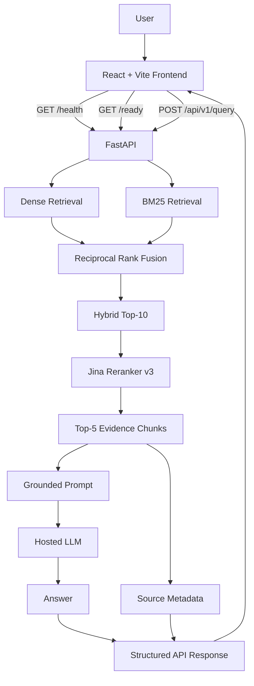

# PolicyIQ

> A grounded insurance document intelligence system built to retrieve evidence first, answer from that evidence, and abstain when the documents are insufficient.

PolicyIQ is an end-to-end Retrieval-Augmented Generation (RAG) project built around real public insurance documents. It started as a basic grounded retrieval pipeline and evolved into a measured, evaluated, production-style application with hybrid retrieval, reranking, reliability analysis, FastAPI serving, Dockerized backend execution, and a complete React frontend.

The project is now **feature-complete and frozen**. Future learning and experimentation will continue in separate projects rather than changing the evaluated PolicyIQ core.

---

## What PolicyIQ does

PolicyIQ lets a user ask insurance questions in natural language and returns:

- a grounded answer,
- the source documents used,
- PDF page numbers,
- request-stage timings,
- and an explicit abstention when the available evidence is insufficient.

Example question:

```text
What is the maximum No Claim Bonus?
```

The system retrieves evidence from the insurance corpus, combines dense and sparse search, reranks the candidate passages, sends only the final evidence to the LLM, and returns the answer with source metadata.

---

## Final Product

```text
React + Vite Frontend
        │
        │ HTTP
        ▼
FastAPI Serving Layer
        │
        ▼
Hybrid Retrieval
Dense + BM25
        │
        ▼
Reciprocal Rank Fusion
        │
        ▼
Jina Reranker v3
        │
        ▼
Top-5 Evidence Chunks
        │
        ▼
Grounded LLM Generation
        │
        ▼
Answer + Sources + Timings
```

### Product behavior

PolicyIQ is intentionally conservative.

If the retrieved documents do not provide enough evidence, it returns:

```text
I could not find sufficient information in the provided documents.
```

Abstention is treated as a valid product behavior, not as an API failure.

---

# Project Evolution

PolicyIQ was developed in measured stages rather than as one large build.

## V1 — Core Grounded RAG

The first version established the complete baseline pipeline:

- PDF ingestion
- metadata enrichment
- repeated-header/footer cleaning
- recursive text chunking
- multilingual sentence-transformer embeddings
- Chroma vector storage
- dense retrieval
- grounded LLM generation
- source citations
- strict abstention behavior

### V1 corpus snapshot

| Metric | Value |
|---|---:|
| PDFs | 11 |
| Raw page documents | 431 |
| Usable page documents | 430 |
| Chunks | 1,144 |
| Chunk size | 1,200 characters |
| Chunk overlap | 200 characters |
| Average chunk length | ~979 characters |
| Median chunk length | ~1,139 characters |

### V1 strict expected-evidence retrieval

| K | Hit@K |
|---:|---:|
| 1 | 31.6% |
| 3 | 42.1% |
| 5 | 63.2% |
| 10 | 63.2% |
| 15 | 73.7% |
| 20 | 73.7% |

---

## V2 — Retrieval Optimization

V2 improved retrieval quality by adding:

- BM25 sparse retrieval
- dense + sparse hybrid search
- Reciprocal Rank Fusion
- Jina reranking
- query-expansion experiments
- retrieval benchmarking

Final runtime retrieval design:

```text
Question
   ↓
Dense Top-10 + BM25 Top-10
   ↓
Reciprocal Rank Fusion
   ↓
Hybrid Top-10
   ↓
Jina Reranker
   ↓
Top-5 evidence
```

Query expansion was tested but not made the default because it added latency and could introduce retrieval noise.

---

## V3 — Reliability Evaluation

V3 moved the project from "it seems to work" to measured end-to-end evaluation.

A 24-question golden set was created:

- 7 exact questions
- 7 semantic questions
- 5 multi-document questions
- 5 unanswerable questions

### Frozen V3 quality

| Metric | Result |
|---|---:|
| Faithfulness | 1.75 / 2 |
| Relevance | 1.368 / 2 |
| Correct unanswerable refusals | 5 / 5 |
| False refusals | 4 / 19 |
| Answerable response rate | 15 / 19 |

### Frozen V3 latency

| Metric | Time |
|---|---:|
| Average | 104.93 s |
| Median | 99.97 s |
| P95 | 163.27 s |
| Minimum | 68.40 s |
| Maximum | 166.20 s |

The evaluation showed that reranking dominated end-to-end latency.

---

## V4 — Reliability & Performance Hardening

V4 focused on understanding and improving the real bottleneck rather than changing the whole architecture.

The Jina reranker remained part of the retrieval design, while CPU execution was hardened and benchmarked again.

### Frozen V4 latency

| Metric | V3 | V4 |
|---|---:|---:|
| Average | 104.93 s | **21.75 s** |
| Median | 99.97 s | **19.59 s** |
| P95 | 163.27 s | **32.47 s** |
| Minimum | 68.40 s | **15.20 s** |
| Maximum | 166.20 s | **33.91 s** |

Approximate median speedup:

```text
~5.1x
```

### Frozen V4 quality

| Metric | Result |
|---|---:|
| Faithfulness | **1.93 / 2** |
| Relevance | **1.474 / 2** |
| Citation correctness | 14 PASS, 1 PARTIAL |
| Citation completeness | 14 PASS, 1 PARTIAL |
| Correct unanswerable refusals | **5 / 5** |
| False refusals | **4 / 19** |
| Answerable response rate | **15 / 19** |

### Important evaluation note

The V3 and V4 faithfulness/citation denominators are not identical, so those changes should not be treated as a perfectly controlled quality comparison. Relevance uses the same 19-answerable-question denominator.

A more permissive generation prompt was also tested during V4. It sometimes produced unsupported coverage conclusions, so the experiment was rejected and the conservative grounding prompt was retained.

---

## V5 — Production API & Docker Serving

V5 froze the evaluated RAG intelligence layer and focused on serving it like a real backend.

Added:

- FastAPI application
- Pydantic request/response models
- `/api/v1/query`
- `/health`
- `/ready`
- startup model preloading
- production-style exception handling
- structured response timings
- API test suite
- portable runtime paths
- Dockerized Linux backend
- environment-based secret handling

### API verification

The V5 API test suite completed with:

```text
9 passed
```

A real end-to-end Docker request also successfully executed:

```text
Windows host
    ↓
Docker Linux container
    ↓
FastAPI
    ↓
Hybrid retrieval
    ↓
Jina reranker
    ↓
Hosted LLM
    ↓
Grounded answer + sources + timings
```

One observed Docker request took approximately:

```text
Hybrid retrieval    ~0.09 s
Jina reranking      ~36.85 s
LLM generation      ~1.09 s
Total               ~38.02 s
```

This is a **single V5 container runtime observation**, not a replacement for the frozen V4 benchmark.

---

## V6 — User-Facing Product

The final phase added the complete frontend experience over the frozen backend.

Frontend stack:

- React
- Vite
- modern CSS
- native Fetch API

The UI includes:

- responsive landing/query experience
- real-time API readiness status
- natural-language question composer
- example insurance prompts
- long-running loading state
- grounded answer presentation
- source cards with document ID and PDF page
- clickable source references
- explicit abstention UI
- error and retry states
- expandable request timing diagnostics
- mobile-friendly responsive layout

The frontend communicates with the existing V5 API without modifying the evaluated RAG behavior.

---

# Architecture



---

# Technology Stack

## AI / RAG

- LangChain
- Hugging Face
- Sentence Transformers
- `sentence-transformers/paraphrase-multilingual-MiniLM-L12-v2`
- Jina Reranker v3
- Chroma
- BM25
- Reciprocal Rank Fusion

## Backend

- Python 3.12
- FastAPI
- Pydantic
- Uvicorn
- PyMuPDF
- Pandas
- NumPy

## Frontend

- React 18
- Vite
- JavaScript
- CSS
- Fetch API

## Infrastructure / Engineering

- Docker
- Git / GitHub
- Pytest
- HTTPX
- environment-based configuration
- versioned evaluation artifacts
- architecture decision records

---

# Corpus

PolicyIQ uses **11 authentic public insurance documents**, including:

- motor insurance policy documents,
- a health insurance policy,
- IRDAI regulations,
- IRDAI circulars,
- motor insurance FAQs,
- motor insurance service-provider guidelines.

The corpus is not synthetic.

The document manifest stores metadata such as:

```text
document_id
filename
document_type
issuer
insurer
product
year
category
source_url
```

---

# Retrieval Design

## Dense Retrieval

Embedding model:

```text
sentence-transformers/paraphrase-multilingual-MiniLM-L12-v2
```

Configuration:

- CPU inference
- normalized embeddings
- 384-dimensional vectors
- Chroma persistence

## Sparse Retrieval

BM25 is built over the same cleaned and chunked corpus.

## Fusion

Dense and sparse candidates are merged with Reciprocal Rank Fusion.

## Reranking

Model:

```text
jinaai/jina-reranker-v3
```

The reranker receives the hybrid candidate set and selects the final passages used for generation.

---

# API

## Health

```http
GET /health
```

Example:

```json
{
  "service": "PolicyIQ API",
  "status": "running",
  "version": "5.0"
}
```

## Readiness

```http
GET /ready
```

Example:

```json
{
  "service": "PolicyIQ API",
  "ready": true
}
```

## Query

```http
POST /api/v1/query
```

Request:

```json
{
  "question": "What is maximum No Claim Bonus?"
}
```

Response shape:

```json
{
  "question": "What is maximum No Claim Bonus?",
  "answer": "...",
  "sources": [
    {
      "document_id": "DOC009",
      "filename": "Motor Insurance_FAQ.pdf",
      "page": 2
    }
  ],
  "timings": {
    "hybrid_retrieval_ms": 0.0,
    "reranking_ms": 0.0,
    "context_prompt_ms": 0.0,
    "llm_client_ms": 0.0,
    "llm_generation_ms": 0.0,
    "response_build_ms": 0.0,
    "total_ms": 0.0
  }
}
```

---

# Project Structure

```text
Policy_IQ/
│
├── frontend/
│   ├── public/
│   ├── src/
│   │   ├── components/
│   │   ├── lib/
│   │   ├── App.jsx
│   │   ├── main.jsx
│   │   └── styles.css
│   ├── package.json
│   ├── package-lock.json
│   ├── vite.config.js
│   └── README.md
│
├── src/
│   ├── api/
│   │   ├── main.py
│   │   ├── schemas.py
│   │   └── dependencies.py
│   ├── chunking/
│   ├── evaluation/
│   ├── ingestion/
│   ├── rag/
│   └── retrieval/
│
├── data/
│   ├── raw/
│   ├── processed/
│   └── menifest.csv
│
├── evaluation/
│   ├── questions.json
│   ├── rag_runs/
│   └── reports/
│
├── tests/
│   └── api/
│
├── docs/
├── config.py
├── requirements.txt
├── Dockerfile
├── .dockerignore
├── .env.example
└── README.md
```

> `menifest.csv` is retained with its existing filename to preserve the established project structure.

---

# Running PolicyIQ Locally

You need two terminals: one for the backend and one for the frontend.

## 1. Backend setup

From the project root:

```powershell
python -m venv venv
.\venv\Scripts\Activate.ps1
pip install -r requirements.txt
```

Create a `.env` file:

```env
HUGGINGFACEHUB_ACCESS_TOKEN=hf_your_token_here
HF_TOKEN=hf_your_token_here
```

Never commit `.env`.

Start FastAPI:

```powershell
uvicorn src.api.main:app --host 0.0.0.0 --port 8000
```

Backend:

```text
http://localhost:8000
```

Swagger:

```text
http://localhost:8000/docs
```

---

## 2. Frontend setup

Open a second terminal:

```powershell
cd frontend
npm install
npm run dev
```

Frontend:

```text
http://localhost:5173
```

For local development, Vite proxies:

```text
/api
/health
/ready
```

to the FastAPI backend on port `8000`.

---

# Docker Backend

Build:

```powershell
docker build -t policyiq-backend:v5 .
```

Run:

```powershell
docker run --name policyiq-v5 --env-file .env -p 8000:8000 policyiq-backend:v5
```

Useful endpoints:

```text
http://localhost:8000/health
http://localhost:8000/ready
http://localhost:8000/docs
```

Stop:

```powershell
docker stop policyiq-v5
```

Remove:

```powershell
docker rm policyiq-v5
```

The Docker image currently covers the backend. The final frontend is run separately through Vite for local development.

---

# Testing

Run API tests from the project root:

```powershell
python -m pytest tests/api -q
```

The final V5 API verification produced:

```text
9 passed
```

The API tests cover:

- health behavior
- readiness state
- validation
- successful query contract
- abstention
- internal service errors

Heavy RAG evaluation is intentionally separate from the lightweight API contract tests.

---

# Error Semantics

PolicyIQ distinguishes between insufficient evidence and system failure.

## Valid abstention

```text
HTTP 200
```

```text
I could not find sufficient information in the provided documents.
```

## Service not ready

```text
HTTP 503
```

## Internal processing error

```text
HTTP 500
```

The public API returns a generic failure message while the server retains the detailed traceback.

---

# Startup Preloading

On startup, the serving layer preloads:

- embedding model,
- Chroma vector store,
- BM25 corpus,
- Jina reranker,
- LLM client.

This removes model initialization from the first user query.

It does **not** remove the per-query CPU reranking cost.

---

# Evaluation Philosophy

PolicyIQ was built around measurement rather than visual inspection alone.

The debugging model used throughout the project:

```text
Answer missing from chunks
→ ingestion / chunking

Answer exists but is not retrieved
→ embedding / retrieval / ranking

Correct evidence retrieved but answer is wrong
→ generation / prompt / LLM

No evidence but model answers
→ grounding / abstention
```

Engineering principles:

```text
Build.
Measure.
Fail.
Understand.
Improve.
Freeze.
Repeat.
```

More specifically:

- measure before optimizing,
- freeze evaluated versions,
- separate retrieval failures from generation failures,
- do not loosen grounding merely to improve answer rate,
- treat abstention as valid product behavior,
- avoid changing the evaluated RAG core during productionization.

---

# Known Limitations

- CPU reranking remains the main latency bottleneck.
- Four answerable golden questions still produced false refusals in the frozen V4 evaluation: `Q003`, `Q004`, `Q008`, `Q018`.
- Fresh Docker containers may need to download Hugging Face model files during startup.
- Multiple Uvicorn workers would duplicate model memory and are not recommended for the current local CPU setup.
- The live corpus contains documents added after the earliest golden expected-evidence design, so valid evidence can sometimes exist outside the original expected evidence pairs.
- PolicyIQ is a document intelligence project, not a substitute for an insurer, regulator, legal professional, or the current policy wording applicable to a real claim.

---

# Version History

```text
V1  Core grounded RAG
 ↓
V2  Hybrid retrieval + reranking
 ↓
V3  End-to-end reliability evaluation
 ↓
V4  Performance + reliability hardening
 ↓
V5  FastAPI + tests + Docker backend
 ↓
V6  Complete user-facing React frontend
```

Frozen Git milestones include:

```text
v2.0
v3.0
v4.0
v5.0
```

V6 represents the final product-facing phase of PolicyIQ.

---

# Why This Project Was Built

The purpose of PolicyIQ was not to build another PDF chatbot.

The project was used to learn and demonstrate how a RAG system changes when it is treated as an engineering system instead of only an LLM demo:

- ingestion quality matters,
- chunking decisions matter,
- retrieval must be measured,
- top-ranked evidence matters more than raw vector similarity,
- generation should be grounded,
- abstention needs to be intentional,
- latency needs stage-level profiling,
- evaluation should survive across versions,
- APIs need failure semantics,
- models need startup lifecycle handling,
- local code needs to work outside the original machine,
- and a technical backend becomes much more useful once it has a clear product interface.

---

# Project Status

## PolicyIQ is now frozen.

The project reached the intended endpoint:

```text
Real insurance documents
        ↓
Evaluated RAG
        ↓
Hybrid retrieval
        ↓
Reranking
        ↓
Grounded generation
        ↓
Reliability benchmarking
        ↓
Production-style FastAPI
        ↓
Dockerized backend
        ↓
Complete React frontend
```

Future work in LangGraph, agentic AI, advanced RAG, orchestration, or new infrastructure will be explored in **new projects** rather than continuously expanding PolicyIQ.

This keeps PolicyIQ as a clear record of one complete engineering journey from baseline RAG to a usable end-to-end product.

---

## Repository

**GitHub:** [Atishaygang/PolicyIQ](https://github.com/Atishaygang/PolicyIQ)

---

## Author

**Atishay Jain**

Built as an applied AI engineering project focused on grounded RAG, retrieval evaluation, reliability analysis, backend serving, containerization, and product delivery.
